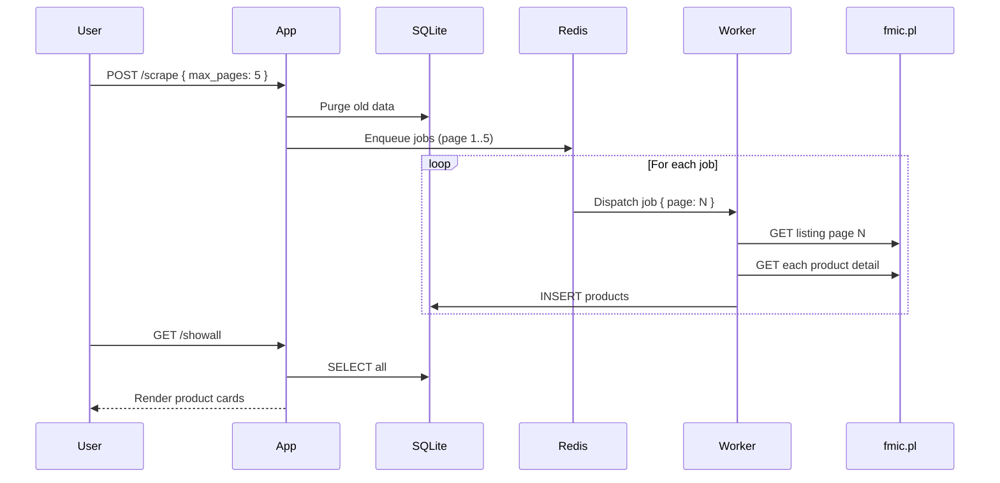

# big-scraper

Scrapes [intercooler product data](https://fmic.pl/uklad-chlodzenia/intercoolery) from fmic.pl, extracts dimensions from detail pages, computes volume and price-per-cm³ metrics, and stores everything in a local database for comparison.

## Architecture

```
┌───────────────────────────────────────────────────────────┐
│                      docker compose                       │
│                                                           │
│   ┌──────────┐     ┌──────────────┐     ┌────────────┐  │
│   │  Express  │────▶│  BullMQ      │────▶│   Worker   │  │
│   │   App     │     │  (Redis)     │     │   x N      │  │
│   │ :3000     │     │  :6379       │     │            │  │
│   └──────────┘     └──────────────┘     └─────┬──────┘  │
│                                               │          │
│                                          ┌────▼──────┐  │
│                                          │  SQLite   │  │
│                                          │  (WAL)    │  │
│                                          └───────────┘  │
└───────────────────────────────────────────────────────────┘
```



## Tech Stack

| Layer | Technology |
|-------|-----------|
| Runtime | Node.js 22 |
| HTTP | Express 5 |
| Queue | BullMQ + Redis |
| Database | SQLite (WAL mode) |
| Scraping | Cheerio |
| Templates | EJS |
| Container | Docker Compose |

## Quick Start

```bash
cp .env.example .env
# edit .env if needed — BASE_URL defaults to fmic.pl intercoolers

docker compose up --scale worker=3
```

Open [http://localhost:3001](http://localhost:3001):

- **Home** — enter page count, click "Run Scraper"
- **/showall** — browse all scraped intercoolers sorted by price-per-cm³
- **GET /intercoolers** — raw JSON API

## Scaling Workers

```bash
# 1 worker  (default)
docker compose up

# 3 workers
docker compose up --scale worker=3

# 5 workers
docker compose up --scale worker=5
```

BullMQ distributes jobs across all workers. SQLite WAL mode + busy timeout handles concurrent writes. Each worker also processes up to 5 jobs internally (`concurrency: 5`), so 3 workers = up to 15 concurrent page scrapes.

## Data Model

```
intercoolers
├── id          INTEGER PRIMARY KEY
├── name        TEXT
├── price       REAL
├── dimensions  TEXT          (e.g. "600 x 300 x 76 mm")
├── url         TEXT UNIQUE
├── capacityCm3 REAL          (volume in cm³)
└── pricePerCm3 REAL          (PLN per cm³)
```

## Project Structure

```
src/
├── index.js                    Express entry point
├── controllers/                Route handlers
│   ├── scrape.controller.js
│   ├── app.controller.js
│   └── intercoolers.controller.js
├── models/
│   ├── scrape.model.js         Cheerio HTML parser (listing + detail)
│   ├── database.model.js       SQLite init & connection
│   └── intercoolers.model.js   CRUD for intercoolers
├── routes/
│   ├── scrape.route.js
│   ├── app.route.js
│   └── intercoolers.route.js
├── utils/
│   └── scrape.js               BullMQ producer (enqueues page jobs)
├── views/
│   ├── index.ejs               Home page with scrape trigger
│   └── showAll.ejs             Product comparison grid
└── queue/worker/
    └── worker.js               BullMQ consumer (processes page jobs)
```

## Env Variables

| Variable | Default | Description |
|----------|---------|-------------|
| `BASE_URL` | `https://fmic.pl/uklad-chlodzenia/intercoolery` | Target listing page |
| `PORT` | `3000` | Express listen port |
| `REDIS_HOST` | `redis` | Redis hostname |
| `REDIS_PORT` | `6379` | Redis port |
