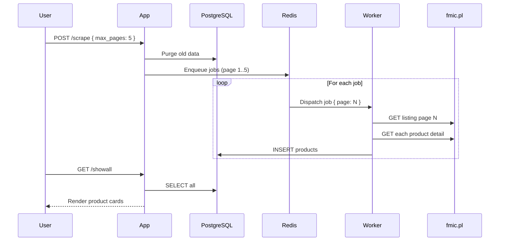

# big-scraper

Scrapes [intercooler product data](https://fmic.pl/uklad-chlodzenia/intercoolery) from fmic.pl, extracts dimensions from detail pages, computes volume and price-per-cm³ metrics, and stores everything in a PostgreSQL database for comparison.

## Github Actions Status


## Architecture

```
┌──────────────────────────────────────────────────────────────────┐
│                        docker compose                             │
│                                                                   │
│  ┌──────────┐    ┌──────────────┐    ┌────────────┐              │
│  │  Express  │───▶│    BullMQ    │───▶│   Worker   │              │
│  │   App     │    │   (Redis)    │    │   x N      │              │
│  │  :3000    │    │   :6379      │    │            │              │
│  └──────────┘    └──────────────┘    └─────┬──────┘              │
│                                             │                     │
│                                        ┌────▼──────┐              │
│                                        │ PostgreSQL │              │
│                                        │  :5432     │              │
│                                        └───────────┘              │
└──────────────────────────────────────────────────────────────────┘
```



## Tech Stack

| Layer | Technology |
|-------|-----------|
| Runtime | Node.js 22 |
| HTTP | Express 5 |
| Queue | BullMQ + Redis |
| Database | PostgreSQL 16 |
| Scraping | Cheerio |
| Templates | EJS |
| Container | Docker Compose |

## Quick Start

```bash
cp .env.example .env
# edit .env if needed — BASE_URL defaults to fmic.pl intercoolers

docker compose up --scale worker=3
```

Open [http://localhost:3001](http://localhost:3001):

- **Home** — enter page count, click "Run Scraper"
- **/showall** — browse all scraped intercoolers sorted by price-per-cm³
- **/intercoolers** — raw JSON API
- **/scrape/status** — polling endpoint for scrape progress (waiting, active, completed, failed, done)

## Scaling Workers

```bash
# 1 worker  (default)
docker compose up

# 3 workers
docker compose up --scale worker=3

# 5 workers
docker compose up --scale worker=5
```

BullMQ distributes jobs across all workers. PostgreSQL handles concurrent writes. Each worker processes up to 5 jobs internally (`concurrency: 5`), so 3 workers = up to 15 concurrent page scrapes.

## Data Model

```
intercoolers
├── id             SERIAL PRIMARY KEY
├── name           TEXT
├── price          REAL
├── dimensions     TEXT             (e.g. "600x300x76 mm")
├── url            TEXT UNIQUE
├── capacity_cm3   REAL             (volume in cm³)
└── price_per_cm3  REAL             (PLN per cm³)
```

## Project Structure

```
src/
├── index.js                      Express entry point
├── controllers/                  Route handlers
│   ├── scrape.controller.js      Enqueue + status polling
│   ├── app.controller.js         Home page + /showall
│   └── intercoolers.controller.js  JSON API
├── models/
│   ├── scrape.model.js           Cheerio HTML parser (listing + detail)
│   ├── database.model.js         PostgreSQL pool & schema init
│   ├── intercoolers.model.js     CRUD for intercoolers
│   └── queue.model.js            BullMQ Queue (producer)
├── routes/
│   ├── scrape.route.js
│   ├── app.route.js
│   └── intercoolers.route.js
├── utils/
│   └── scrape.js                 Enqueues page jobs into BullMQ
├── views/
│   ├── index.ejs                 Home page with scrape trigger
│   └── showAll.ejs               Product comparison grid (cards)
└── queue/worker/
    └── worker.js                 BullMQ Worker (consumer, concurrency: 5)
```

## Env Variables

| Variable | Default | Description |
|----------|---------|-------------|
| `BASE_URL` | `https://fmic.pl/uklad-chlodzenia/intercoolery` | Target listing page |
| `PORT` | `3000` | Express listen port |
| `REDIS_HOST` | `redis` | Redis hostname |
| `REDIS_PORT` | `6379` | Redis port |
| `PGHOST` | `postgres` | PostgreSQL hostname |
| `PGUSER` | `scraper` | PostgreSQL user |
| `PGPASSWORD` | `scraper` | PostgreSQL password |
| `PGDATABASE` | `bigscraper` | PostgreSQL database name |

## Deployment

### Via GitHub Actions

Pushes to `master` trigger automatic deployment to a DigitalOcean droplet via SSH:

1. `git pull origin master` in `/var/www/big-scraper/`
2. `docker compose up -d --scale worker=3 --remove-orphans`

Requires these GitHub secrets: `DO_HOST`, `DO_USER`, `DO_SSH_KEY`.

### Auto-start after droplet reboot

Add `restart: unless-stopped` to the `app`, `worker`, and `postgres` services in `docker-compose.yml` to ensure containers recover after a reboot.

### Nightly restart via cron

To gracefully restart all containers every night at 2:00 AM:

```bash
crontab -e
```

Add this line:

```
0 2 * * * cd /var/www/big-scraper && /usr/bin/docker compose restart
```
